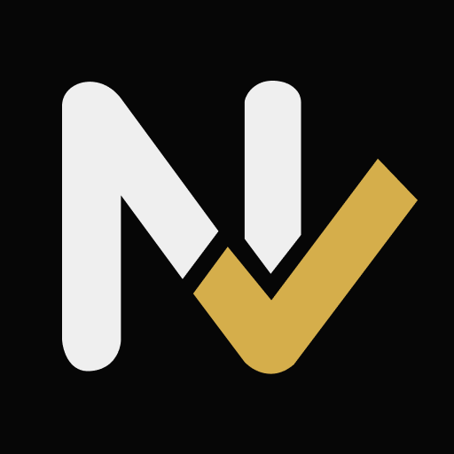

<p align="center">
  <a href="https://nod-archive.com">
    
  </a>
</p>

<h3 align="center">NOD</h3>

<p align="center">
  Turn anything you read into knowledge you keep.
  <br />
  <a href="https://nod-archive.com">Website</a> · <a href="https://chromewebstore.google.com/detail/nod-article-analyzer/lifmaapjkbpfbdppiaeidcnicidpfknp">Chrome Extension</a> · <a href="https://github.com/jidohyun/NOD/issues">Issues</a>
</p>

<p align="center">
  <a href="https://github.com/jidohyun/NOD/blob/main/LICENSE"></a>
  <a href="https://github.com/jidohyun/NOD/stargazers"></a>
  <a href="https://github.com/jidohyun/NOD/issues"></a>
</p>

<p align="center">
  <a href="README.ko.md">한국어</a>
</p>

---

<a href="https://www.producthunt.com/products/nod-7?embed=true&amp;utm_source=badge-featured&amp;utm_medium=badge&amp;utm_campaign=badge-nod-8" target="_blank" rel="noopener noreferrer"></a>

NOD is a Chrome extension and web app that summarizes web content with AI and saves it as searchable knowledge — not just bookmarks.

It started as a personal [n8n + Gemini + Obsidian automation](https://velog.io/@do-hyun123/ipone-n8n-automation). People kept asking me to set it up for them, so I turned it into a product anyone can install in 30 seconds.

<p align="center">
  
</p>

## What it does

- **Web articles** — Summarize any webpage and extract key insights
- **GitHub repos** — Analyze project structure and core logic, not just the README
- **YouTube videos** — Get the key points from hour-long talks without watching them
- **Papers & PDFs** — Quickly parse arXiv papers and technical documents
- **Semantic search** — Find saved knowledge by meaning, not just keywords
- **Knowledge graph** — Visualize connections between saved concepts

## Architecture

```
apps/
├── web/          # Next.js 16 — dashboard, search, knowledge graph
├── api/          # FastAPI — AI summarization, auth, storage
├── worker/       # FastAPI — async jobs via Cloud Tasks & Pub/Sub
├── extension/    # Chrome Extension — content capture & summarization
├── mobile/       # flutter (planned)
└── infra/        # Terraform — GCP Cloud Run deployment
```

## Tech stack

| Layer | Stack |
|-------|-------|
| Frontend | [Next.js](https://nextjs.org) · [TypeScript](https://www.typescriptlang.org) · [Tailwind CSS](https://tailwindcss.com) · [Radix UI](https://www.radix-ui.com) · [Cytoscape](https://js.cytoscape.org) |
| Backend | [FastAPI](https://fastapi.tiangolo.com) · [Python](https://www.python.org) · [SQLAlchemy](https://www.sqlalchemy.org) · [pgvector](https://github.com/pgvector/pgvector) |
| AI | [Google Gemini](https://ai.google.dev) · [OpenAI](https://platform.openai.com) |
| Database | [PostgreSQL](https://www.postgresql.org) · [Redis](https://redis.io) |
| Auth | [Supabase](https://supabase.com) |
| Infra | [GCP Cloud Run](https://cloud.google.com/run) · [Terraform](https://www.terraform.io) |
| Payments | [Paddle](https://www.paddle.com) |
| Observability | [OpenTelemetry](https://opentelemetry.io) · [Sentry](https://sentry.io) · [Langfuse](https://langfuse.com) |

## Getting started

### Prerequisites

- [Bun](https://bun.sh) (package manager)
- [Python 3.12+](https://www.python.org) with [uv](https://docs.astral.sh/uv/)
- [PostgreSQL](https://www.postgresql.org) with pgvector extension
- [Redis](https://redis.io)

### Development

```bash
# Web dashboard
cd apps/web
bun install
bun run dev

# API server
cd apps/api
uv sync
poe dev

# Worker
cd apps/worker
uv sync
poe dev

# Chrome extension
cd apps/extension
npm install
npm run dev
```

See each app's directory for detailed configuration.

## Self-hosting

NOD is fully self-hostable. You'll need:

1. A PostgreSQL database with pgvector
2. Redis instance
3. A Gemini or OpenAI API key

Infrastructure is defined as Terraform in `apps/infra/`. The hosted version at [nod-archive.com](https://nod-archive.com) is $5/month if you'd rather not manage your own setup.

## Contributing

Bug reports, feature requests, and PRs are welcome. Check the [issues](https://github.com/jidohyun/NOD/issues) for things to work on.

```bash
# Run checks before submitting
cd apps/web && bun run lint && bun run typecheck
cd apps/api && poe all-checks
```

## License

[MIT](LICENSE)
